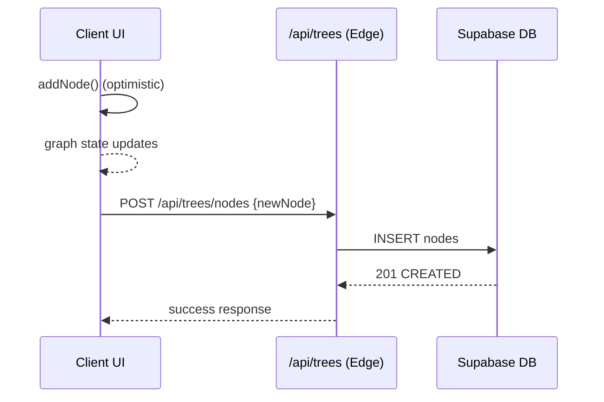
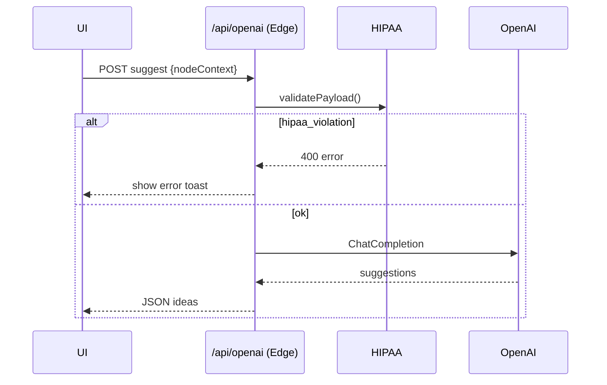
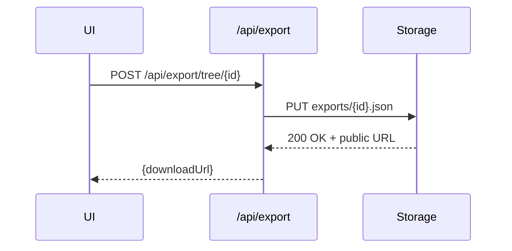

# Architecture – Forkli

> **Version:** 2025‑05‑28  |  **Status:** Draft (MVP scope)  |  **Author:** Abhi + AI Co‑Pilot

---

## 1  High‑Level System Overview

The application follows a **client‑edge‑service** pattern optimised for ultra‑low latency, modular evolution, and AI‑assisted features.

```
┌───────────────┐   GraphQL‑like REST   ┌────────────────┐   Secure SQL + RPC   ┌──────────────┐
│  Browser SPA  ├──────────────────────►│  Next.js Edge   ├─────────────────────►│  Supabase DB │
│  (Next.js)    │  & Server Actions     │  (Vercel)       │                     │  + Storage   │
└───────────────┘                       └────────────────┘                     └──────────────┘
        ▲                                      │                                    │
        │   WebSocket (post‑MVP)               │Edge Function RPC                   │
        │                                      ▼                                    │
        │                               ┌────────────────┐                         │
        │  Realtime graph patches       │ Supabase Edge  │                         │
        └───────────────────────────────┤  Functions     │◄────────────────────────┘
                                        └────────────────┘
```

> *Rationale*: Keeping server logic at the **edge** (Vercel Functions + Supabase Edge) minimises cold‑start impact and isolates domain‑heavy operations—while the browser owns rich interaction and optimistic state.

---

## 2  Logical Layers & Key Responsibilities

| Layer                              | Tech                                      | Core Duties                                                                                                     | Scalability Concern                            |
| ---------------------------------- | ----------------------------------------- | --------------------------------------------------------------------------------------------------------------- | ---------------------------------------------- |
| **Client (Next.js 14 SPA)**        | React 19, Tailwind, React‑Flow, shadcn/ui | Canvas rendering, offline optimistic CRUD, Mini‑Map, breadcrumb, share modal                                    | Browser perf for 500‑node graphs               |
| **Edge API (Vercel)**              | Next.js API routes & server actions       | Auth verification, rate‑limit, GPT orchestration, **merge global + per‑account feature flags**, export assembly | Vercel cold starts (mitigated by edge runtime) |
| **Edge Functions (Supabase Deno)** | `validate_ops()` • `conflict_detector()`  | Heavy graph validation, recursive SQL, quota enforcement                                                        | CPU timeouts for extremely large graphs        |
| **Database**                       | PostgreSQL 15 (RLS)                       | Trees, nodes, edges, events, users; point‑in‑time rollback                                                      | Index bloat; long‑running queries              |
| **Storage**                        | Supabase Object Storage                   | Binary exports (PNG, JSON)                                                                                      | Object lifecycle cost                          |
| **Realtime (post‑MVP)**            | Supabase WS Channels                      | Collaborative editing, presence                                                                                 | Message storm control                          |

---

## 3  Runtime Topology Diagram (Mermaid)

```mermaid
flowchart TD
    subgraph Client[Browser]
        Canvas
        Sidebar
        Toolbar
    end
    subgraph Edge[Vercel Edge Runtime]
        TreesAPI[/api/trees]
        OpenAIAPI[/api/openai]
        ExportAPI[/api/export]
        EventsAPI[/api/events]
        HIPAA[Middleware]
    end
    subgraph Supabase[Supabase Project]
        DB[(PostgreSQL)]
        Storage[[Storage Buckets]]
        EF1[validate_ops()]
        EF2[conflict_detector()]
    end

    Canvas -->|fetch| TreesAPI
    Sidebar -->|suggest/ rewrite| OpenAIAPI
    Toolbar -->|export| ExportAPI
    Canvas -->|event| EventsAPI

    HIPAA -.-> OpenAIAPI

    TreesAPI -->|RPC| DB
    ExportAPI -->|read/write| Storage
    OpenAIAPI -->|RPC| EF2
    EF1 --> DB
    EF2 --> DB
```

---

## 4  Data Model ERD (Mermaid)

```mermaid
erDiagram
    trees ||--o{ nodes : has
    trees ||--o{ edges : has
    users ||--o{ trees : owns
    nodes ||--o{ edges : "parent of"
    trees ||--o{ events : logged_by

    trees {
      uuid id PK
      text name
      text description
      uuid created_by FK users.id
      timestamptz created_at
    }
    nodes {
      uuid id PK
      uuid tree_id FK trees.id
      text label
      text body
      text type
      text[] tags
      jsonb metadata
      timestamptz created_at
    }
    edges {
      uuid id PK
      uuid tree_id FK trees.id
      uuid from_node_id FK nodes.id
      uuid to_node_id FK nodes.id
      text condition
      jsonb metadata
    }
    users {
      uuid id PK
      text email
      text name
      text[] feature_flags
    }
    events {
      uuid id PK
      uuid tree_id FK trees.id
      uuid user_id FK users.id
      text event_type
      jsonb payload
      timestamptz created_at
    }
```

---

## 5  Key Sequence Diagrams

### 5.1  Node Save (Optimistic CRUD)



*If API fails*, UI rolls back via undo stack.

### 5.2  “Suggest Next Branch”



### 5.3  Export to Dialogflow JSON



---

## 6  Deployment & DevOps Pipeline

1. **Push → PR**: Feature branch pushed, triggers lint + test + build preview.
2. **Preview Deploy**: Vercel assigns URL, Motion task ID posted to PR thread.
3. **Merge → Main**: Auto‑deploy to production, secrets injected via Vercel.
4. **Supabase Migrations**: `supabase db push` runs in CI; breaking changes flagged.
5. **Monitoring**: Vercel Analytics + Sentry (client & edge) + Supabase Logs.

---

## 7  Extensibility Hooks

| Concern       | Extension Point                    | Example Future Feature              |
| ------------- | ---------------------------------- | ----------------------------------- |
| **Realtime**  | Supabase Realtime channel per tree | Live multi‑cursor editing           |
| **Templates** | Node template registry table       | Marketplace for community templates |
| **Auth**      | Supabase OAuth                     | GitHub/Google SSO, org‑level roles  |
| **Storage**   | Bucket path prefix                 | Amazon S3 mirror for enterprise     |

---

## 8  Glossary

| Term              | Meaning                                                                                             |
| ----------------- | --------------------------------------------------------------------------------------------------- |
| **HIPAA Guard**   | Middleware that blocks or redacts text resembling protected health information when `hipaa` flag on |
| **Edge Function** | Serverless Deno function living inside Supabase, callable via signed token                          |
| **Node Tag**      | Freeform label array that powers search, analytics segmentation, and future theming                 |

---

**End of ARCHITECTURE.md**
